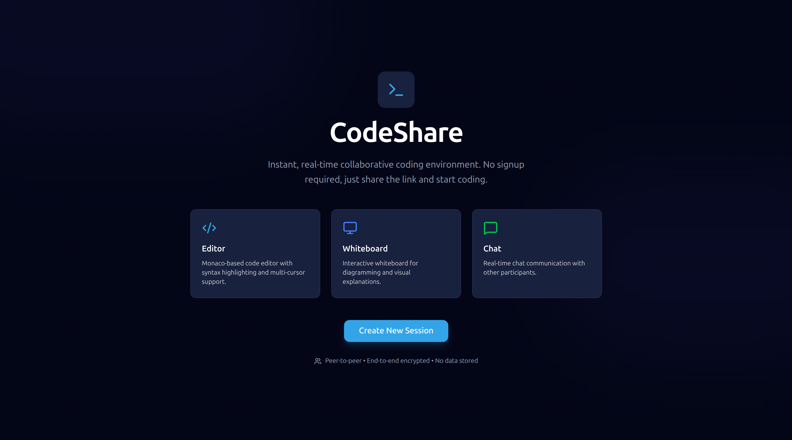
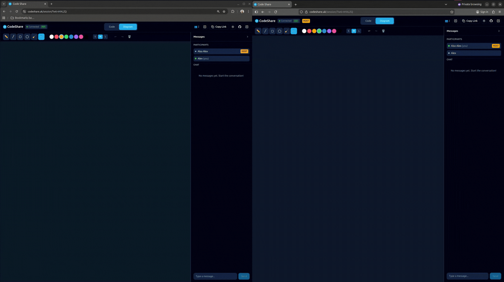

# CodeShare

A real-time, accountless browser-based collaborative code editor and whiteboard for pair programming. Peer-to-peer over WebRTC with TURN support for NAT traversal.





## Features

- **Collaborative Code Editor**: Monaco Editor (10+ languages) with prettier formatting for supported languages
- **Whiteboard**: Canvas-based drawing with pen, line, rectangle, circle tools
- **Live Chat**: Real-time messaging synced across participants
- **Peer-to-Peer**: Content flows directly between browsers via WebRTC
- **Zero Accounts**: Just create a session and share the link
- **Privacy First**: Server only handles signalling, never sees your content

## Quick Start

### Prerequisites

- Node.js 18+
- npm 9+

### Local Development

1. **Clone and install dependencies:**

```bash
# Install client dependencies
npm install

# Install server dependencies
cd server && npm install && cd ..
```

2. **Start the development servers:**

```bash
# Terminal 1: Start signalling server
cd server && npm run dev

# Terminal 2: Start client dev server
npm run dev
```

3. **Open the app:**
   - Visit http://localhost:5173
   - Click "Create Session"
   - Open the session link in another browser tab to test collaboration

## Production Deployment

### Option 1: Docker Compose (Recommended)

```bash
# Build and run both services
docker compose up -d

# Access at http://localhost (client) and http://localhost:3001 (signalling)
```

### Option 2: Manual Deployment

#### Build the client:

```bash
npm run build
# Output in ./dist - serve with any static file server
```

#### Build and run the server:

```bash
cd server
npm run build
NODE_ENV=production npm start
```

### Deployment on Ubuntu VM with Caddy

1. **Install dependencies:**

```bash
# Install Node.js
curl -fsSL https://deb.nodesource.com/setup_20.x | sudo -E bash -
sudo apt-get install -y nodejs

# Install Caddy
sudo apt install -y caddy
```

2. **Build and deploy:**

```bash
# Clone your repo
git clone your-repo-url /opt/codeshare
cd /opt/codeshare

# Build client
npm install && npm run build

# Build server
cd server && npm install && npm run build && cd ..
```

3. **Create systemd service for signalling server:**

```bash
sudo tee /etc/systemd/system/codeshare.service << EOF
[Unit]
Description=CodeShare Signalling Server
After=network.target

[Service]
Type=simple
User=www-data
WorkingDirectory=/opt/codeshare/server
Environment=NODE_ENV=production
Environment=PORT=3001
Environment=CORS_ORIGINS=https://your-domain.com
ExecStart=/usr/bin/node dist/index.js
Restart=on-failure

[Install]
WantedBy=multi-user.target
EOF

sudo systemctl enable codeshare
sudo systemctl start codeshare
```

4. **Configure Caddy:**

```bash
sudo tee /etc/caddy/Caddyfile << EOF
your-domain.com {
    # Serve static files
    root * /opt/codeshare/dist
    file_server

    # SPA fallback
    try_files {path} /index.html

    # Proxy WebSocket to signalling server
    handle /socket.io/* {
        reverse_proxy localhost:3001
    }
}
EOF

sudo systemctl reload caddy
```

## Environment Variables

### Client (`.env`)

Copy `.env.example` to `.env` and configure:

| Variable               | Description                    | Default                        |
| ---------------------- | ------------------------------ | ------------------------------ |
| `VITE_SIGNALLING_URL`  | Signalling server URL          | `http://localhost:3001`        |
| `VITE_STUN_URLS`       | STUN servers (comma-separated) | `stun:stun.l.google.com:19302` |
| `VITE_TURN_URLS`       | TURN server URLs (optional)    | -                              |
| `VITE_TURN_USERNAME`   | TURN username                  | -                              |
| `VITE_TURN_CREDENTIAL` | TURN credential                | -                              |

### Server

| Variable       | Description                       | Default                 |
| -------------- | --------------------------------- | ----------------------- |
| `PORT`         | Server port                       | `3001`                  |
| `CORS_ORIGINS` | Allowed origins (comma-separated) | `http://localhost:5173` |
| `NODE_ENV`     | Environment                       | `development`           |

## Architecture

```
┌─────────────────────────────────────────────────────────────┐
│                      Browser Clients                        │
├─────────────────────────────────────────────────────────────┤
│  ┌─────────────┐    WebRTC Data Channel    ┌─────────────┐  │
│  │   Client A  │◄──────────────────────────│   Client B  │  │
│  │             │                           │             │  │
│  │  - Monaco   │   Yjs CRDT Sync:          │  - Monaco   │  │
│  │  - Canvas   │   • Code (Y.Text)         │  - Canvas   │  │
│  │  - Chat     │   • Whiteboard (Y.Array)  │  - Chat     │  │
│  └──────┬──────┘   • Chat (Y.Array)        └──────┬──────┘  │
│         │                                         │         │
│         │     Socket.IO (signalling only)         │         │
│         └────────────────┬────────────────────────┘         │
│                          │                                  │
├──────────────────────────┼──────────────────────────────────┤
│                          ▼                                  │
│  ┌─────────────────────────────────────────────────────────┐│
│  │                Signalling Server                        ││
│  │  • Room membership (in-memory)                          ││
│  │  • WebRTC offer/answer/ICE relay                        ││
│  │  • NO content storage                                   ││
│  └─────────────────────────────────────────────────────────┘│
└─────────────────────────────────────────────────────────────┘
```

### Key Components

- **Signalling Server** (`/server`): Express + Socket.IO for WebRTC coordination
- **WebRTC Manager** (`/src/lib/webrtc.ts`): Handles peer connections and data channels
- **Yjs Provider** (`/src/lib/yjs-provider.ts`): Custom provider syncing Yjs over WebRTC
- **Session Context** (`/src/lib/session.tsx`): React context managing session state

## TURN Server Setup

For users behind strict NAT/corporate firewalls, you'll need a TURN server:

### Option 1: Hosted Services

- [Twilio TURN](https://www.twilio.com/docs/stun-turn)
- [Metered TURN](https://www.metered.ca/tools/openrelay/)

### Option 2: Self-hosted Coturn

```bash
sudo apt install coturn
sudo tee /etc/turnserver.conf << EOF
listening-port=3478
tls-listening-port=5349
realm=your-domain.com
server-name=your-domain.com
lt-cred-mech
user=username:password
EOF
sudo systemctl enable coturn
sudo systemctl start coturn
```

Then set environment variables:

```
VITE_TURN_URLS=turn:your-domain.com:3478
VITE_TURN_USERNAME=username
VITE_TURN_CREDENTIAL=password
```

## Known Limitations

- **No remote cursors**: Monaco cursor sharing not implemented in MVP

## Deployment Requirements

> [!IMPORTANT]
> **Signalling Server Must Be Stateful**
>
> The signalling server maintains room membership and host election state in memory. This means:
>
> - **Single instance**: Deploy as a single persistent process, not a serverless function
> - **Sticky sessions**: If load-balanced, configure sticky sessions (session affinity) so all WebSocket connections from the same client hit the same instance
> - **WSS required**: Use WebSocket Secure (`wss://`) when the client is served over HTTPS
> - **No serverless**: Do NOT deploy to Vercel Edge Functions, Cloudflare Workers, or similar platforms that don't support persistent WebSocket connections
>
> If you need horizontal scaling, add a shared state adapter (e.g., `@socket.io/redis-adapter`) to synchronise room state across instances.

## Debugging

Enable debug mode by adding `?debug=1` to the URL or setting `VITE_DEBUG=true` environment variable. This logs:

- Session/peer/socket IDs
- Room state updates from server
- WebRTC connection lifecycle (offer/answer, ICE candidates, channel state)
- Yjs sync events (SyncStep1/2, updates, awareness)

Debug state is also exposed to `window.__CODE_SHARE_DEBUG__` for DevTools inspection.

## Tech Stack

- **Client**: Vite + React 19 + TypeScript
- **Editor**: Monaco Editor
- **Realtime**: Yjs CRDT + custom WebRTC provider
- **Signalling**: Socket.IO
- **Server**: Express + Node.js
